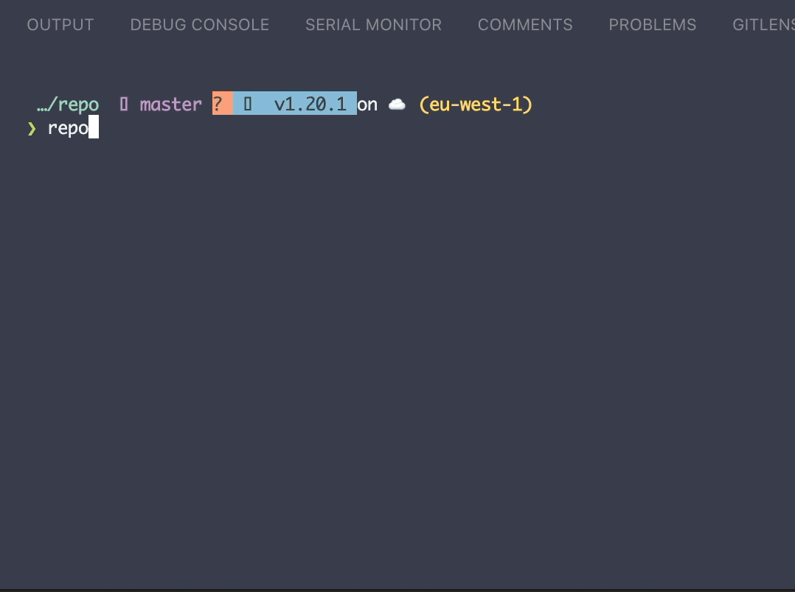

# repo

This is a command-line application built with Go and [Bubble Tea](https://github.com/charmbracelet/bubbletea) that allows you to see your recent repositories on GitHub and open, clone, or copy the URL of the repositories.

## Installation
clone repo and run `make install`